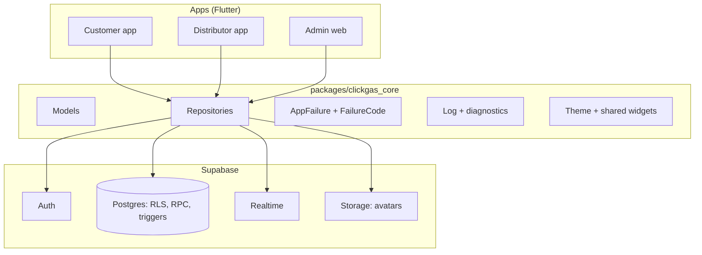

# Architecture

This document explains how ClickGas is put together, why, and where new code
belongs. Decisions behind it are recorded in [decisions/](decisions/).

## Principles

1. **The database is the referee.** Prices, fees, visibility and order status
   rules live in Postgres (Row Level Security, triggers, RPC functions). An app
   bug cannot break them, and a new app gets them for free.
2. **One way in and one way out.** Screens never call Supabase. They use
   controllers; controllers use repositories; only repositories talk to the
   server.
3. **Shared code lives once.** Models, repositories, errors, logging and the
   theme are in `packages/clickgas_core`, used by every app.
4. **Every failure has a name.** Repositories throw only `AppFailure` with a
   stable `FailureCode` ([errors.md](errors.md)). The server raises the same codes.
5. **Nothing changes silently.** Schema changes are numbered migrations, order
   status changes are recorded in `order_events`, fees in `driver_ledger`.
6. **Written down as it's built.** A feature is done when its docs, tests and
   error codes are.

## Layers



Inside an app, code is grouped by feature (`features/orders`, `features/tracking`…).
Each feature holds **screens** (what is shown) and, when needed, **controllers**
(state, exposed with `provider`). Cross-feature state lives in `lib/state/`
(for example `SessionController`, `MyOrdersController`).

```
screen  ──reads──▶  controller (ChangeNotifier)  ──calls──▶  repository  ──▶  Supabase
   ▲                        │
   └──── rebuilds on ───────┘ notifyListeners()
```

A screen may call a repository directly for a one-off action (for example
"cancel order") when no shared state is involved.

## Packages

| Package | Holds | May depend on |
|---|---|---|
| `clickgas_core` | models, repositories, `AppFailure`, `Log`, theme, `UserAvatar`, `NotificationService` | Flutter, supabase_flutter, geolocator, image_picker… |
| `apps/customer` | customer screens, customer-only repositories, translations | `clickgas_core` |
| `apps/distributor` | distributor screens, `DriverRepository`, tracking, translations | `clickgas_core` |
| `apps/admin` | staff dashboard (web): admin models, `AdminRepository`, `StaffSession`, pages, translations | `clickgas_core`, `flutter_map` |

In the customer app, a few files under `lib/core/` and `lib/data/` are one-line
re-exports of `clickgas_core`, kept so existing imports stay short. New code
imports `package:clickgas_core/clickgas_core.dart` directly.

The repository is a Dart **pub workspace**: one `pubspec.lock` at the root, so
every app uses the same dependency versions ([ADR 0003](decisions/0003-monorepo-pub-workspace.md)).

## How an order flows

```mermaid
sequenceDiagram
  participant CA as Customer app
  participant DB as Postgres
  participant DA as Distributor app
  CA->>DB: insert into orders (service, qty, location)
  Note over DB: prepare_new_order() sets price,<br/>fees, status=pending
  DA->>DB: nearby_orders(lat, lng) every 10 s
  DA->>DB: accept_order(id)
  Note over DB: checks online, verified, 3-order limit,<br/>stock, distance; trigger checks transition
  DB-->>CA: Realtime update: accepted
  DA->>DB: drivers.lat/lng every 5 s
  DB-->>CA: Realtime: truck position
  DA->>DB: complete_order(id)
  Note over DB: status=delivered, stock -= qty,<br/>ledger += 0.150
  DB-->>CA: Realtime update: delivered
  CA->>DB: confirm_delivery(id), rate_order(id)
```

## Security model

- **Roles** live in `profiles.role` (`customer`, `driver`, `admin`). The sign-up
  trigger decides the role; the app can only ask for "driver", never "admin".
- **Row Level Security** is on every table. Customers see their own orders;
  distributors see pending orders only through `nearby_orders()` and their own
  assigned orders; staff checks use `is_staff()`.
- **Column grants** limit what an owner may update (a customer can change their
  name, never their role).
- **Writes with rules** go through `security definer` functions with
  `set search_path = ''` and fully qualified names.
- **Order status** changes are checked by `check_order_transition()` against
  the `order_transitions` table.
- **Staff** read through RLS (`is_staff()`) and write only through `admin_*`
  functions that check the role (owner / operations / support) and write
  `admin_actions` ([ADR 0010](decisions/0010-staff-roles-and-audit.md)).
- **Keys:** apps carry only the publishable key. The secret key never leaves
  `.secrets/` ([runbooks/secrets.md](runbooks/secrets.md)).

## Errors and logging

Every repository call is wrapped in `guard('area.action', ...)`:

1. Any exception becomes an `AppFailure` (`AppFailure.from`).
2. The failure is logged with the operation name, code and detail.
3. The screen shows `failureText(context, failure)` in the user's language.
   Codes without a specific message show "code XYZ" so support can look it up.

`Log` keeps the last 300 events in memory. Rules: log events, order numbers and
codes; never passwords, tokens or full addresses. Settings › **Send
diagnostics** uploads the log to the `diagnostics` table
([runbooks/diagnostics.md](runbooks/diagnostics.md)).

## Realtime

| Stream | Used by | Why |
|---|---|---|
| `orders` where `customer_id = me` | customer app | status changes, notifications |
| `orders` where `driver_id = me` | distributor app | refresh active orders, receipt confirmations |
| `drivers` where `is_online` | customer map | distributors near you |
| `drivers` where `id = assigned` | customer tracking | truck position |

Nearby pending orders are polled every 10 seconds, because RLS hides an order
from other distributors the moment it is accepted, and Realtime cannot report a
row disappearing from a filter.

## Environments

Apps read `APP_ENV`, `SUPABASE_URL` and `SUPABASE_PUBLISHABLE_KEY` from
`--dart-define-from-file=env/<name>.json`. See [environments.md](environments.md).

## Scaling notes

- Pending orders stay few, so `nearby_orders()` scans them with a haversine
  distance; PostGIS is the planned upgrade with service zones.
- Distributor locations are written every 5 seconds today. Past a few hundred
  online distributors, move the live position to a Realtime broadcast channel
  and store a snapshot every 30 seconds.
- Reports should read nightly rollups (Phase 4), never scan `orders` live.
- Cities, services, prices, fees, radius and limits are data, not code.

## Adding a feature: checklist

1. Migration in `supabase/migrations/` with RLS, grants and `comment on`.
2. New error codes added to the database function, `FailureCode`, both apps'
   `failureText`, and [errors.md](errors.md).
3. Model + repository method in `clickgas_core` (wrapped in `guard`).
4. Screen/controller in the app; strings in both `app_ar.arb` and `app_en.arb`.
5. Tests: model parsing, database behaviour (pgTAP), and the e2e script if the
   order flow changes.
6. Docs: [api.md](api.md), [business-rules.md](business-rules.md),
   [data-model.md](data-model.md), and a decision record if a trade-off was made.
7. A line in [CHANGELOG.md](../CHANGELOG.md).
