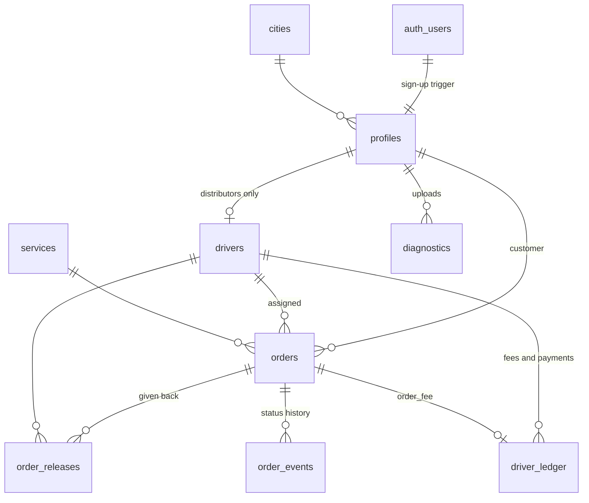

# Data model

Postgres schema in Supabase, built by the files in `supabase/migrations/`.
Every table has Row Level Security. Money is `numeric(12,3)` JOD. Times are
`timestamptz` (UTC in the database, Asia/Amman on screen).

## Tables

| Table | One row per | Key columns |
|---|---|---|
| `profiles` | account | `role` (customer/driver/admin), `full_name`, `phone` (unique), `email`, `city_id`, `avatar_url`, `is_active` |
| `drivers` | distributor | `is_verified`, `is_online`, `lat`, `lng`, `location_updated_at`, `cylinders_on_board`, `vehicle_plate`, `vehicle_model` (vehicle type code), `agency_name`, `rating_sum`, `rating_count` |
| `orders` | order | `order_number` (from 1001), `status`, `service_*` (snapshot), `quantity`, `unit_price`, `delivery_fee`, `service_fee`, `driver_fee`, `total_price`, `payment_method`, `delivery_lat/lng`, `delivery_address`, `notes`, `rating`, `customer_confirmed_at`, one timestamp per status |
| `order_events` | status change | `order_id`, `status`, `actor_id`, `created_at` |
| `order_transitions` | allowed change | `from_status`, `to_status`, `actor`, `via` |
| `order_releases` | order a distributor gave back | snapshot of number, service, quantity, total |
| `driver_ledger` | money movement | `kind` (order_fee/payment/adjustment), `amount` (+ owed, − paid), `order_id` |
| `fee_settings` | fee change | `customer_fee`, `driver_fee`, `effective_from` |
| `services` | thing to order | `code`, names, descriptions, `price`, `badge` |
| `cities` | Jordanian city | names, `lat`, `lng` |
| `app_config` | (single row) | `delivery_fee`, `max_quantity`, `driver_radius_km`, `max_active_orders`, `auto_verify_drivers`, `min_*_version` |
| `diagnostics` | uploaded log | `app`, `app_version`, `environment`, `platform`, `logs` (jsonb), `note` |
| `job_runs` | scheduled job run | `job`, `started_at`, `finished_at`, `ok`, `detail` |
| `feature_flags` | switch | `key`, `enabled`, `description` |
| `private.login_attempts` | failed phone login | `phone`, `attempted_at` (not reachable from the API) |

## Views

| View | Returns |
|---|---|
| `current_fees` | the `fee_settings` row in force now |

## Storage

| Bucket | Path | Access |
|---|---|---|
| `avatars` (public) | `<user id>/avatar.jpg` | anyone reads; owner writes |

## Enums

- `user_role`: customer, driver, admin
- `order_status`: pending, accepted, on_the_way, delivered, cancelled, expired
- `payment_method`: cash, card
- `ledger_kind`: order_fee, payment, adjustment

## Migrations

| File | Adds |
|---|---|
| `20260911000000_init.sql` | core tables, RLS, order RPCs, cities and services |
| `20260911120000_driver_app.sql` | distributor sign-up, multi-order dispatch, releases, receipt confirmation |
| `20260911180000_slots_avatars.sql` | slot frees on delivery, avatars bucket, photos in RPCs |
| `20260912090000_foundation.sql` | fils, fees + ledger, state machine, safe phone login, diagnostics, job runs, flags, descriptions |
