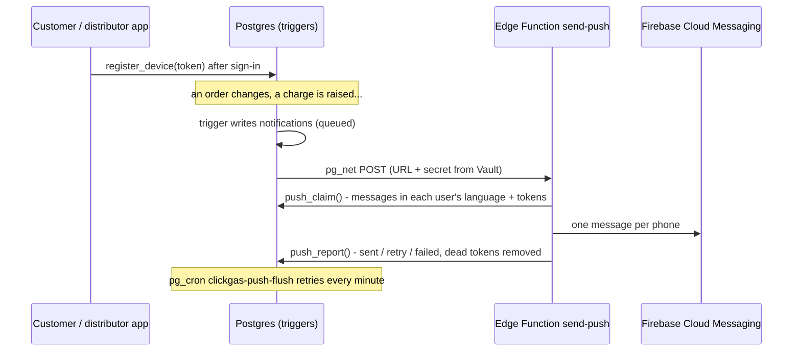

# Push notifications: setup and checks

Pushes reach a phone even when the app is closed. The database decides who is
told what; the Edge Function `send-push` delivers through Firebase Cloud
Messaging (FCM). Design: [ADR 0014](../decisions/0014-push-notifications.md).



Without any of the setup below the apps still work: messages are kept in the
in-app history (bell icon in Settings) and the apps show their own
notifications while open.

## One-time setup

### 1. Firebase

Project: `clickgas-d3964` (Firebase console).

1. **Android apps**: Project settings › General › Your apps. Both must be there:
   `com.clickgas.app` (customer) and `com.clickgas.driver` (distributor).
2. **google-services.json**: download it (one file covers both apps) and copy it
   to `apps/customer/android/app/` and `apps/distributor/android/app/`. It is
   git-ignored; the Gradle Google-services plugin is applied only when the file
   is there, so builds without it still work (no pushes on those builds).
3. **Service account**: Project settings › Service accounts › Generate new
   private key. Save it as `.secrets/firebase-service-account.json`. It can
   send pushes to every user: never commit it or put it in an app.

### 2. Database

Apply `supabase/migrations/20260913150000_push_notifications.sql` in the SQL
Editor ([migrations.md](migrations.md)).

### 3. Edge Function

```sh
node tools/push/setup.mjs              # writes .secrets/push.env and .secrets/push-vault.sql
npx supabase login
npx supabase link --project-ref rggjsueryxymukcnqawd
npx supabase secrets set --env-file .secrets/push.env
npx supabase functions deploy send-push --no-verify-jwt
```

`--no-verify-jwt`: the caller is the database, which proves itself with the
shared secret (`x-push-secret` header) instead of a user token.

### 4. Tell the database where the function is

Run `.secrets/push-vault.sql` in the SQL Editor. It stores two Vault secrets:
`clickgas_push_url` and `clickgas_push_secret` (the same value as
`PUSH_WEBHOOK_SECRET`). Running it again updates them.

## Check it works

1. Install a build that has `google-services.json`, sign in, allow
   notifications. Settings › Notifications should say "Notifications reach you
   even when the app is closed".
2. The phone is registered:
   ```sql
   select p.full_name, t.app, t.platform, t.last_seen_at
     from device_tokens t join profiles p on p.id = t.user_id
    order by t.last_seen_at desc limit 5;
   ```
3. Send yourself a test (use your user id), close the app, wait a few seconds:
   ```sql
   select private.notify('<user id>', 'customer', 'test',
     'تجربة', 'إشعار تجريبي من ClickGas', 'Test', 'A test notification from ClickGas');
   ```
4. What happened to it:
   ```sql
   select id, kind, push_status, push_attempts, push_error, created_at, sent_at
     from notifications order by id desc limit 10;
   ```

## Push states

| `push_status` | Meaning |
|---|---|
| `queued` | Waiting for the Edge Function |
| `sending` | Claimed by the function (back to `queued` if it doesn't report within 2 minutes) |
| `sent` | FCM accepted it for at least one phone |
| `muted` | The user turned that kind off (Settings › Notifications); history only |
| `no_device` | No phone registered for that app |
| `failed` | 5 attempts failed; see `push_error` |
| `expired` | Not sent within 30 minutes (stale news); history only |

Messages are kept 60 days.

## Troubleshooting

| Symptom | Check |
|---|---|
| Everything stays `queued` | Vault secrets set? `select name from vault.secrets where name like 'clickgas_push%';` Function deployed? Last calls: `select status_code, content::text, created from net._http_response order by created desc limit 5;` |
| `401` in `net._http_response` | `clickgas_push_secret` differs from `PUSH_WEBHOOK_SECRET`: run `node tools/push/setup.mjs`, `secrets set` and `push-vault.sql` again |
| `503 FCM_SERVICE_ACCOUNT is not set` | `npx supabase secrets set --env-file .secrets/push.env` |
| `failed`, `push_error` mentions `SENDER_ID_MISMATCH` | `google-services.json` and the service account are from different Firebase projects |
| `failed`, `403` / `PERMISSION_DENIED` | Enable "Firebase Cloud Messaging API (V1)" for the project in Google Cloud console |
| `no_device` for everyone on one app | That app was built without `google-services.json` (Settings footer says "only while the app is open"), or the user denied the notification permission |
| One user gets nothing | Their `device_tokens` row, their `notify_*` switches in `profiles`, phone settings › Apps › ClickGas › Notifications |
| Function logs | Supabase › Edge Functions › send-push › Logs (`send_push` lines with claimed / sent / failed counts) |

## Rotating

- **Shared secret**: delete the line from `.secrets/push.env`, run
  `node tools/push/setup.mjs`, then `secrets set` and `push-vault.sql`.
- **Service account**: generate a new key in Firebase, replace
  `.secrets/firebase-service-account.json`, run `setup.mjs` and `secrets set`,
  then delete the old key in Google Cloud › IAM › Service accounts.
